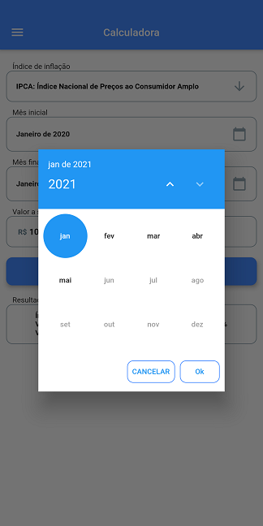

# Correção Monetária

Correção Monetária realiza a correção de um valor em relação a inflação ocorrida em um determinado período. 

Os seguintes índices são suportados pelo aplicativo:
- Índice Geral de Preços do Mercado (IGP-M) da Fundação Getúlio Vargas (FGV);
- Índice Nacional de Preços ao Consumidor (INPC) do Instituto Brasileiro de Geografia e Estatística (IBGE);
- Índice Nacional de Preços ao Consumidor-Amplo (IPCA) do Instituto Brasileiro de Geografia e Estatística (IBGE).

O período suportado compreende qualquer intervalo de tempo em que a moeda corrente é o Real (a partir de julho de 1994).




## Funcionamento

O cálculo é realizado sobre o *principal* com a aplicação iterativa de uma série histórica de um índice de inflação mensal. As séries de IGPM, INPC e IPCA são obtidas do webservice público do Banco Central do Brasil. Elas são armazenadas localmente e atualizadas quando novos dados forem publicados pela instituição.

## Como Executar

1. Baixe o [Google Flutter **1.22.6**](https://flutter.dev/docs/development/tools/sdk/releases) e siga as [instruções oficiais de instalação e configuração](https://flutter.dev/docs/get-started/install).

2. Abra o diretório *src* do projeto em sua IDE e restaure as dependências (pacotes) ou faça isso através do comando a seguir.
```
flutter pub get
```
3. Opcionalmente, você pode executar os testes unitários implementados no projeto através do comando abaixo ou com o auxílio de sua IDE.
```
flutter test
```
4. Com o emulador em funcionamento ou com um dispositivo devidamente conectado ao seu computador, acione a função de executar em sua IDE ou faça isso com o seguinte comando:
```
flutter run
```

## Recomendações para Android

Para obter maior performance no desenvolvimento, evite o uso de emuladores, prefira depurar o programa em um dispositivo físico. Além disso, também é possível substituir o Android Studio pelo [Visual Studio Code](https://code.visualstudio.com/) e instalar suas extensões _Flutter_ e _Dart_.

Para remover completamente o aplicativo do dispositivo, utilize o comando abaixo na ferramenta ADB que acompanha o SDK.
```
adb uninstall br.com.jitsukawa.correcao_monetaria
```
## Google Play Store

Correção Monetária foi [**publicado na Google Play Store**](https://play.google.com/store/apps/developer?id=Jitsukawa) em junho de 2021.

[](https://play.google.com/store/apps/developer?id=Jitsukawa)